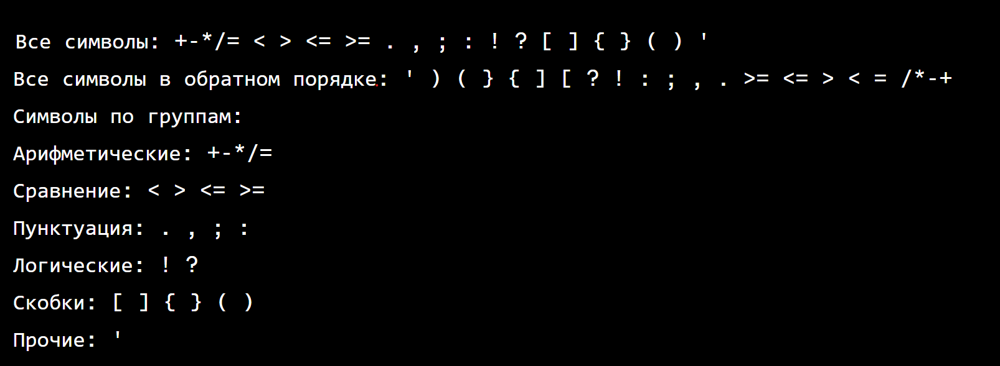

## Задача 1: Расскажите о себе

Код-скелет

````java
public class Main {

    void currentCity() {
    }

    void yourNickname() {
    }

    public static void main(String[] args) {
    }

    void yourName() {
    }

    void casualTalk() {
    }
}
````

**Ожидаемый вывод** (обратите внимание на порядок вывода)

````text
Как вас зовут?
Меня зовут Андрей
Как к вам обращаться на занятиях?
Андрей
Вы не против со временем перейти на ты?
Со временем, да
В каком городе сейчас проживаете?
Berlin
````

## Задача 2: Упражнение по отладке

Исправить не компилируемый код

Код-скелет

[MainProgram.java](MainProgram.java)

Ожидаемый вывод

````text
Hello, World!
````

## Задача 3: Вывести специальные символы
Вывести на консоль наиболее часто используемые специальные символы в одном выводе и затем в обратном порядке.
Вывести символы по группам.

````java
public class CommonSymbols {
    public static void main(String[] args) {
        /*
        printSymbolsByGroups();
        printSymbolsInReverse();
        printSymbols();
        */
    }

    public static void printSymbols() {
        // code..
    }

    public static void printSymbolsInReverse() {
        // code..

    }

    public static void printSymbolsByGroups() {
        System.out.println("Символы по группам:");
        System.out.println("Арифметические: ...");
        System.out.println("Сравнение: ...");
        // ...        
    }
}
````

**Ожидаемый вывод** (обратите внимание на порядок вывода)




## Задача 4: Понимание переменных и присваивания
Объявление переменных, их инициализации и присваивания значений.

````java
public class VariableBasics {
    public static void main(String[] args) {
        // Объявите переменную типа int с именем 'daysInDecember'
        // Инициализируйте 'daysInDecember' значением 31
        // Объявите и инициализируйте переменную типа double с именем 'pi' значением 3.14159
        // Объявите переменную типа String с именем 'favoriteDrink' и присвойте ей название вашего любимого напитка
        // Выведите все переменные в консоль
    }
}
````

**Ожидаемый вывод** (обратите внимание на порядок вывода)
````text
Дней в декабре: 31
Число Пи: 3.14159
Любимый напиток: [Ваш любимый напиток]
````
