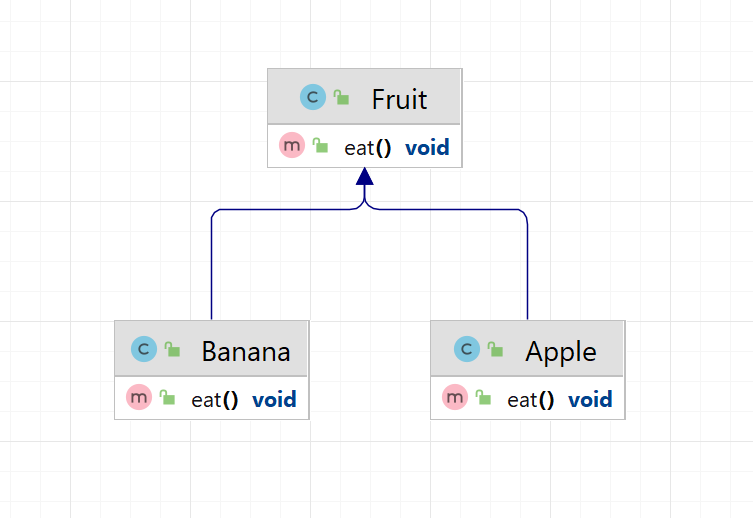
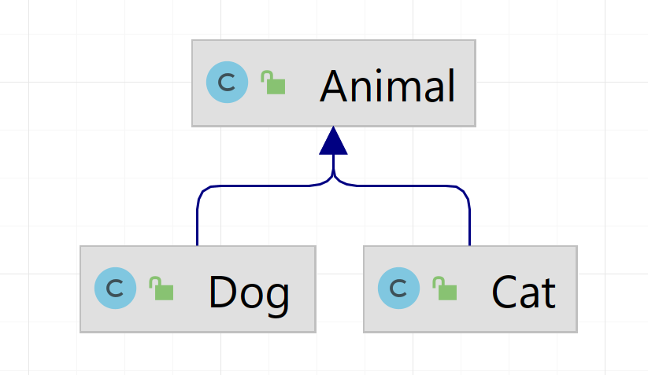
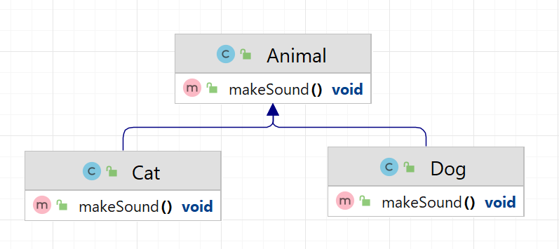

<details style="margin-top: 16px">
  <summary style="cursor: pointer; color: blue;"><b>English</b></summary>

## Inheritance:

**Inheritance** is like inheritance in real life, for example when a child inherits some traits from his
parents. In programming, this means that one class can inherit the properties and methods of another class.
For example, we have a class "Fruit" and we create a subclass "Apple". An apple automatically inherits the properties of
the fruit,
such as color and weight.

Example:

```java
class Fruit {
    String color;
    double weight;
}

class Apple extends Fruit {
    // We automatically inherit the color and weight from the Fruit class
    String variety;
}

class Banana extends Fruit {
    // We automatically inherit the color and weight from the Fruit class
    String variety;
}
```



### Overriding methods in subclasses:

**Method overriding** is like changing the rules of the game. If we have a method in the superclass, we can
override it in a subclass to make it specific to that subclass. This allows us to use
same method name, but with different actions for different classes.

Imagine that we have Animals, all animals can reproduce sound. But each animal does this differently.
For example, a cat makes “meow-meow”, a dog “woof-woof”.

**Animal** is the parent class for all animals.
**Dog** is a subclass representing a dog.
**Cat** is a subclass representing a cat.
**makeSound()** - method that outputs the sound made by an animal

Example:



```java
public class Animal { // parent class for all animals

    void makeSound() {
        System.out.println("Animal sound, not sure which one"); // outputs the sound made by the animal
    }
}

public class Dog extends Animal { // subclass representing a dog

}

public class Cat extends Animal { // subclass representing a cat

}
```

````java
public class Main {

    public static void main(String[] args) {
        Dog dog = new Dog();
        dog.makeSound(); // The sound of an animal, it’s not clear which one

        Cat dog = new Cat();
        Cat.makeSound(); // The sound of an animal, it’s not clear which one
    }
}
````

In this example, the dog and cat will be able to play sound, but only as defined in the parent class.
Because every time we use the `makeSound()` method, no matter what type, “Sound” will always be output to the console
animal, it’s not clear which one.”

But we said that the cat should reproduce “meow-meow”, and the dog “woof-woof”. Those. play the sound `makeSound()` but
already in my own way.

```java
public class Animal {

    public void makeSound() {
        System.out.println("Animal sound, not sure which one");
    }
}

public class Dog extends Animal {

    @Override // overridden super class method
    public void makeSound() {
        System.out.println("Woof-woof!"); // specified the behavior of the method for the Dog class
    }
}

public class Cat extends Animal {

    @Override // overridden super class method
    public void makeSound() {
        System.out.println("Meow meow!"); // specified the behavior of the method for the Cat class
    }
}
```



This code overrides the parent `makeSound()` method in each descendant class. What allows animals
reproduce the correct sounds.

````java
public class Main {

    public static void main(String[] args) {
        Dog dog = new Dog();
        dog.makeSound(); //  Bow-wow!

        Cat dog = new Cat();
        Cat.makeSound(); //  Meow meow!
    }
}
````

## Cast:

**Typecasting** is like turning one thing into another. In Java, this may be needed when we have an object
one class, but we want to use it as an object of another class. This may be explicit or implicit.

Let's look at the example of dogs and cats to better understand type casting.

We have a class hierarchy:

1. `Animal` - parent class for all animals.
2. `Dog` is a subclass representing a dog.
3. `Cat` is a subclass representing a cat.

Each class has a `makeSound()` method that outputs the sound the animal makes.


Now let's look at type casting:

```java
Animal animal1=new Dog(); // Implicit type cast, dog becomes animal
        Animal animal2=new Cat(); // Implicit type cast, cat becomes animal

        Dog dog=(Dog)animal1; // Explicit type cast, animal becomes dog
        Cat cat=(Cat)animal2; // Explicit type cast, animal becomes cat
```

In this example:

1. `animal1` and `animal2` are variables of type `Animal`, but they contain objects `Dog` and `Cat`. This is an implicit
   type cast because we are "narrowing down" the types.

2. `dog` and `cat` are variables of type `Dog` and `Cat`, but we explicitly specify the types to be cast. We "extend"
   types back to subclasses.

Now we can call the `makeSound()` method on each variable:

```java
animal1.makeSound(); // Outputs: Woof-woof!
        animal2.makeSound(); // Outputs: Meow-meow!
        dog.makeSound(); // Outputs: Woof-woof!
        cat.makeSound(); // Outputs: Meow-meow!
```

Type casting allows us to work with objects of different classes in the hierarchy and use their specific methods when
necessary.

### Upward and downward type casting:

1. **Upcasting**:
    - This is a casting of an object to its superclass or interface.
    - Occurs automatically (implicitly).
    - This is a safe cast because the object can always be treated as an object of its superclass.

An example of an ascending cast:

```java
Cat cat=new Cat();
        Animal animal=cat; // Upcast, cat automatically becomes an Animal object.
```

2. **Downcasting**:
    - This is the casting of an object to its subclass after an upward cast.
    - Occurs using the `(Type)` type cast operator and may throw a `ClassCastException` if the object cannot be cast to
      the specified type.
    - This is a riskier cast and requires type checking before performing the cast.

Downcast example:

```java
Animal animal=new Cat(); // Ascending cast
        Cat cat=(Cat)animal; // Downcast, requires explicit type cast
```

Thus, an upward cast is usually safe and automatic, but a downcast can cause an error and requires an explicit type cast
and type checking before it is performed.

### Errors when casting types:

Type casting errors and the differences between upward and downward casting are important aspects of working with type
casting in Java. Let's take a closer look at these concepts.

1. **ClassCastException**:
    - This exception occurs when an attempt is made to perform an invalid type cast.
    - For example, if we have an `Animal` object that is actually a `Cat` object, and we try to explicitly cast it to
      the `Dog` type, it will throw a `ClassCastException`.

Example:

```java
Animal animal=new Cat();
        Dog dog=(Dog)animal; // Will throw a ClassCastException because animal is not actually a Dog object.
```

To avoid such errors, you should always perform type checking using the `instanceof` operator before casting the type.

Type checking example:

```java
Animal animal=new Cat();
        if(animal instanceof Dog){
        Dog dog=(Dog)animal; // This code will only run if animal is a Dog object.
        }
```

</details>

<hr>

<details style="margin-top: 16px">
  <summary style="cursor: pointer; color: blue;"><b>На русском</b></summary>

## Наследование:

**Наследование** - это как наследование в реальной жизни, например, когда ребенок наследует некоторые черты от своих
родителей. В программировании, это означает, что один класс может наследовать свойства и методы другого класса.
Например, у нас есть класс "Фрукт", и мы создаем подкласс "Яблоко". Яблоко автоматически наследует свойства фрукта,
такие как цвет и вес.

Пример:

```java
class Fruit {
    String color;
    double weight;
}

class Apple extends Fruit {
    // Мы автоматически наследуем цвет и вес из класса Fruit
    String variety;
}

class Banana extends Fruit {
    // Мы автоматически наследуем цвет и вес из класса Fruit
    String variety;
}
```


### Переопределение методов в подклассах:

**Переопределение методов** - это как изменение правил игры. Если у нас есть метод в суперклассе, мы можем
переопределить его в подклассе, чтобы сделать его специфичным для этого подкласса. Это позволяет нам использовать
одинаковое имя метода, но с разными действиями для разных классов.

Представьте что у нас есть Животные, все животные могут воспроизводить звук. Но каждое животное делает это по разному.
К примеру кошка делает "мяу-мяу", собачка "гав-гав".

**Animal** - родительский класс для всех животных.
**Dog** - подкласс, представляющий собаку.
**Cat** - подкласс, представляющий кошку.
**makeSound()** - метод который выводит звук, издаваемый животным

Пример:


```java
public class Animal { // родительский класс для всех животных

    void makeSound() {
        System.out.println("Звук животного, не понятно какой"); // выводит звук, издаваемый животным
    }
}

public class Dog extends Animal { // подкласс, представляющий собаку

}

public class Cat extends Animal { // подкласс, представляющий кошку

}
```

````java
public class Main {

    public static void main(String[] args) {
        Dog dog = new Dog();
        dog.makeSound(); //  Звук животного, не понятно какой

        Cat dog = new Cat();
        Cat.makeSound(); //  Звук животного, не понятно какой        
    }
}
````

В этом примере собака и кошка будут уметь воспроизводить звук, но только так как это опрделено в родительском классе.
Т.к. каждый раз когда мы возовим метод `makeSound()` не важно у какого типа, всегда будет выведенно в коносль "Звук
животного, не понятно какой".

Но мы сказали что кошка должна воспроизводить "мяу-мяу", а собачка "гав-гав". Т.е. вопроизводить звук `makeSound()` но
уже по свойму.

```java
public class Animal {

    public void makeSound() {
        System.out.println("Звук животного, не понятно какой");
    }
}

public class Dog extends Animal {

    @Override // переопределили метод супер класса
    public void makeSound() {
        System.out.println("Гав-гав!");  // указали поведение метода для класса Dog
    }
}

public class Cat extends Animal {

    @Override // переопределили метод супер класса
    public void makeSound() {
        System.out.println("Мяу-мяу!"); // указали поведение метода для класса Cat
    }
}
```


Этот код переопределяет в каждом классе наследнике родительский метод `makeSound()`. Что позволяет животным
воспроизводить верные звуки.

````java
public class Main {

    public static void main(String[] args) {
        Dog dog = new Dog();
        dog.makeSound(); //  Гав-гав!

        Cat dog = new Cat();
        Cat.makeSound(); //  Мяу-мяу!        
    }
}
````

## Приведение типов:

**Приведение типов** - это как превращение одной вещи в другую. В Java, это может быть нужно, когда у нас есть объект
одного класса, но мы хотим его использовать как объект другого класса. Это может быть явным или неявным.

Давайте рассмотрим пример с собачками и кошками, чтобы лучше понять приведение типов.

У нас есть иерархия классов:

1. `Animal` - родительский класс для всех животных.
2. `Dog` - подкласс, представляющий собаку.
3. `Cat` - подкласс, представляющий кошку.

Каждый класс имеет метод `makeSound()`, который выводит звук, издаваемый животным.


Теперь давайте рассмотрим приведение типов:

```java
Animal animal1=new Dog(); // Неявное приведение типа, собака становится животным
        Animal animal2=new Cat(); // Неявное приведение типа, кошка становится животным

        Dog dog=(Dog)animal1; // Явное приведение типа, животное становится собакой
        Cat cat=(Cat)animal2; // Явное приведение типа, животное становится кошкой
```

В этом примере:

1. `animal1` и `animal2` - это переменные типа `Animal`, но они содержат объекты `Dog` и `Cat`. Это неявное приведение
   типов, так как мы "сужаем" типы.

2. `dog` и `cat` - это переменные типа `Dog` и `Cat`, но мы явно указываем типы для приведения. Мы "расширяем" типы
   обратно к подклассам.

Теперь мы можем вызвать метод `makeSound()` для каждой переменной:

```java
animal1.makeSound(); // Выведет: Гав-гав!
        animal2.makeSound(); // Выведет: Мяу-мяу!
        dog.makeSound();     // Выведет: Гав-гав!
        cat.makeSound();     // Выведет: Мяу-мяу!
```

Приведение типов позволяет нам работать с объектами разных классов в иерархии и использовать их специфические методы,
когда это необходимо.

### Восходящее и нисходящее приведение типов:

1. **Восходящее приведение (Upcasting)**:
    - Это приведение объекта к его суперклассу или интерфейсу.
    - Происходит автоматически (неявно).
    - Это безопасное приведение, так как объект всегда может быть рассмотрен как объект его суперкласса.

Пример восходящего приведения:

```java
Cat cat=new Cat();
        Animal animal=cat; // Восходящее приведение, cat автоматически становится объектом Animal.
```

2. **Нисходящее приведение (Downcasting)**:
    - Это приведение объекта к его подклассу после восходящего приведения.
    - Происходит с использованием оператора приведения типа `(Type)` и может вызвать `ClassCastException`, если объект
      невозможно привести к указанному типу.
    - Это более рискованное приведение, и оно требует проверки типа перед выполнением приведения.

Пример нисходящего приведения:

```java
Animal animal=new Cat(); // Восходящее приведение
        Cat cat=(Cat)animal;    // Нисходящее приведение, требует явного приведения типа
```

Таким образом, восходящее приведение обычно безопасно и выполняется автоматически, а нисходящее приведение может вызвать
ошибку и требует явного приведения типа и проверки типа перед его выполнением.

### Ошибки при приведении типов:

Ошибки при приведении типов и различия между восходящим и нисходящим приведением типов - это важные аспекты работы с
приведением типов в Java. Давайте подробнее разберемся в этих концепциях.

1. **ClassCastException**:
    - Это исключение возникает при попытке выполнить недопустимое приведение типов.
    - Например, если у нас есть объект `Animal`, который на самом деле является объектом `Cat`, и мы пытаемся явно
      привести его к типу `Dog`, это вызовет `ClassCastException`.

Пример:

```java
Animal animal=new Cat();
        Dog dog=(Dog)animal; // Вызовет ClassCastException, так как animal на самом деле не является объектом Dog.
```

Чтобы избежать таких ошибок, всегда следует выполнять проверку типов с использованием оператора `instanceof` перед
приведением типа.

Пример проверки типа:

```java
Animal animal=new Cat();
        if(animal instanceof Dog){
        Dog dog=(Dog)animal; // Этот код выполнится только, если animal является объектом Dog.
        }
```

</details>
